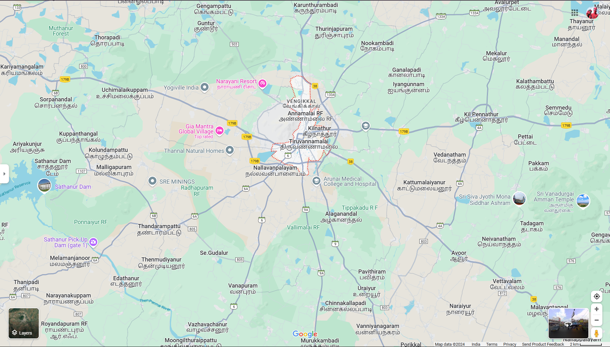

# Ex04 Places Around Me
## Date: 18.12.2024

## AIM
To develop a website to display details about the places around my house.

## DESIGN STEPS

### STEP 1
Create a Django admin interface.

### STEP 2
Download your city map from Google.

### STEP 3
Using ```<map>``` tag name the map.

### STEP 4
Create clickable regions in the image using ```<area>``` tag.

### STEP 5
Write HTML programs for all the regions identified.

### STEP 6
Execute the programs and publish them.

## CODE
'''

map.html

<html>
<head>

<title>My City</title>
    
</head>
    
<body>
    
<h1 align="center">
    
<font color="blue"><b>TIRUVANNAMALAI</b></font>
    
</h1>
    
<h3 align="center">
    
<font color="black"><b>Balaji j (24901175)</b></font>
    
</h3>
    
<center>
  

    
<map name="MyCity">
    
<area shape="rect" coords="600, 250, 800, 300" href="home.html" title="My Home Town" >
    
<area shape="circle" coords="700, 200, 50" href="temple.html" title="Annamalaiyar Temple">
    <area shape="circle" coords="100, 350, 50" href="dam.html" title="Sathanur Dam">
   
<area shape="circle" coords="400, 600, 50" href="river.html" title="River">
    </map>
    
</center>
    
</body>
    </html>


home.html


<html>
    home.html
    <html>
    <body bgcolor="yellow">
       <h2> About District</h2>

Tiruvannamalai is one of the most venerated places in Tamil Nadu. In ancient times, the term afceAnnamalaise meant an inaccessible mountain. The word a€œThirul was prefixed to signify its greatness, and coupled with the two terms, it is called Tiruvannamalai. The Temple Town of Tiruvannamalai is one of the most ancient heritage sites of India and is a centre of the Saiva religion. The Arunachala hill and its environs have been held is great regard by the Tamils for centuries. The temple is grand in conception and architecture and is rich in tradition, history and festivals. The main Deepam festival attracts devotees from far and wide throughout South India. It has historic places besides Tiruvannamalai, Arni, Vandavasi, Devigapuram connected to East India and French companies. In the late Chola period this district was ruled by the Cholan of Sambuvarayar having Padavedu near Armi as HQ. We can now find the fort and note along with a Shiva temple namely Kailasanathar in Arni town.

<h2>Administrative Units</h2>

Tiruvannamalai District was created from erstwhile North Arcot District on 30-09-1989. The district is surrounded by Kanchipuram district in the East, Villupuram district in the south, Dharmapuri and Krishnagiri Districts in the West and Vellore District in the North as its boundaries. Tiruvannamalai District is divided into 3 Revenue Divisions namely Tiruvannamalai, Arni and Cheyyar and 12 Tahuks namely Tiruvannamalai, Kilpennathur, Chengam Thandarampattu, Kalasapakkam Polur, Arni, Chetput, Cheyyar, Vembakkam, Vandavasi and Jamanamarathur. They are further sub-divided into 18 development blocks, 4 Municipalities and 10 Towu Panchayats and 860 Village Panchayats.

<h2>Location</h2>

Tiruvannamalai District is located in the Northern part of Tamilnadu with a distance of 190 km from Chennai and 210 km from Trichy.

<h2>Agriculture</h2>

Tiruvannamalai District is leading producer of Rice. The quality rice produced from Ami region is being exported to throughout Tamil Nadu and to other States of India and foreign countries. Thinai, Samai and Varags millets, Seetha and Jackfruit are producing in Jawadhu hills. Banana plantation is widely practiced in Padavedu region. Approximately 56% of people are depended on Agriculture related work

<h2>Industries</h2>

Tiruvannamalai district is a backward district in terms of Industrial production. Agricultural based industries like Sugar mills are situated in Polur, Cheyyar and Kozhunthampatru. The Lakshmi Sarsowathy Cotton mill is functioning at Sevur near Armi. Cheyyar SIPCOT industrial estate is famous for production of finished leather goods and automobile accessories and provides more employment opportunity for the people in the North enttem part of this district. Apan from these, Granite industries make Black Stones, Colored Stones and soft stones

<h2>Tourism</h2>

Tiruvannamalai District is famous for spiritual and religious aspect. The world famous Annamalaiyar temple, Padavedu Renuganunhal temple. Thennnagur Pandurangar Temple and Devikapurun Periyanayagi amman temple se of the main spiritual centers. Sathanur Dam, Jawadhu Hills are the famous tourist places. Tirumalai Jain temple, Mamandur cave temples, Koolamandal and Branmadesam are the heritage sites of this district

<h2>Education</h2>

Tiruvannamalai District is divided into 5 educational district viz Tiruvannamalai, Arni, Cheyyar, Chengam and Polur comprising a total of 1798 primary schools, 219 Highschools, 160 Higher Secondary School apart from CBSE schools are functioning in the district. Forest Department schools with hostel facilities are running for tribal people in Jawadhu hills.

<h2>Health</h2>

There are 417 Health Sub Centers and 114 Primary Health Centers and 20 Hospitals and one Government Medical College are funtioning for the service of people under the control of Public Health Department, Five vetinary hospitals and 113 dispensaries are functioning under the control of Animal Husbandry Department.
    </body>
</html>
 dam.html
<html>
    <body bgcolor="green">
       <h2> SATHANUR DAM</h2>
       Sathanur Dam which forms the Sathanur reservoir, is one of the major dams in Tamil Nadu. It is constructed across the Thenpennai River also called as Pennaiyar River in Thandarampet taluk among Chennakesava Hills. The dam can be reached by road 30 km (19 mi) from Tiruvannamalai City. It was constructed in 1958. There is also a large crocodile farm and a fish grotto. Parks are maintained inside the dam for tourists to visit and the gardens have been used by the film industry. Sathanur dam and reservoir is the third largest in Tamil Nadu after Mettur and Bhavanisagar.
       The Sathanur Dam Project was proposed in the First Five Year Plans of India and started in the year 1953. The Dam works are completed in the Second Five Year Plans of India and is operational from 1958.[2] The project was inaugurated by the then Chief Minister of Tamil Nadu K. Kamaraj. This is one of the Major irrigation schemes were planned in Kamaraj's period . The other projects are Lower Bhavani, Krishnagiri Dam, Mani Muthuar, Cauvery Delta, Aarani River, Vaigai Dam, Amravathi, Sathanur, Pullambadi, Parambikulam and Neyaru Dams.[3]

      The approved cost of the project is ₹2.02 Crores. The project was completed within ₹3.59 Crore (Actual cost). The project is covered under CADA (Command Area Development Authority) Scheme.[2]

 </body>
</html>
 river.html
<html>
    <body bgcolor="blue">
       <h2> THENPANNAI RIVER</h2>
       The South Pennar River (also known as Dakshina Painakini in Kannada and Thenpennai or Ponnaiyar or Pennaiyar in Tamil) is a river in India. It is the second longest river in Tamil Nadu, with a length of 497 km, after the Kaveri. Chandapura, Anekal, Hosur, Bagalur and Chengam are the major industrial settlements on its banks. The river is severely polluted by industrial waste as it flows through major industrial areas in the eastern suburbs of Bangalore and the industrial parks of Hosur and Chengam.[citation needed]

       The river originates in the Nandi Hills in the Chikkaballapura district of Karnataka and flows through Tamil Nadu before emptying into the Bay of Bengal. It has a catchment area of 1,424 square miles (3,690 km2) located in Karnataka and Tamil Nadu states. The small Kelavarapalli and Krishnagiri Dams were built across this river near Hosur and Krishnagiri.[1] The largest dam on this river, Sathanur Dam with 7.3 Tmcft Gross Capacity is near Tiruvannamalai. The Moongilthuraipattu Sugar Factory is also situated on the bank of river.[citation needed]
       
       The river is dry most of the year. Water flows during the monsoon season when it is fed by the south-west monsoon in the catchment area and the northeast monsoon in Tamil Nadu. This water flow raises the water table throughout the river basin and feeds numerous reservoirs/tanks.

 </body>
</html>
temple.html
<html>
   <body bgcolor="orange">
    Arunachalesvara Temple (also called Annamalaiyar Temple) is a Hindu temple dedicated to the god Shiva, located at the base of Arunachala hill in the town of Tiruvannamalai in Tamil Nadu, India. It is significant to the Hindu sect of Shaivism as one of the temples associated with the five elements, the Pancha Bhuta Sthalas, and specifically the element of fire, or Agni.

    Shiva is worshiped as Arunachalesvara or Annamalaiyar, and is represented by the lingam, with his idol referred to as Agni lingam. His consort Parvati is depicted as Unnamulai Amman.[2][3] The presiding deity is revered in the 7th century CE Tamil Saiva canonical work, the Tevaram, written by Tamil saint poets known as the Nayanars and classified as Paadal Petra Sthalam. The 9th century CE Shaiva saint poet Manikkavacakar composed the Tiruvempavai here.
    
    The temple complex covers 10 hectares, and is one of the largest in India.[4] It houses four gateway towers known as gopurams. The tallest is the eastern tower, with 11 stories and a height of 66 metres (217 ft), making it one of the tallest temple towers in India built by Sevappa Nayakar (Nayakar dynasty).[4] The temple has numerous shrines, with those of Arunachalesvara and Unnamalai being the most prominent. The temple complex houses many halls; the most notable is the thousand-pillared hall built during the Vijayanagara dynasty.
    
    The present masonry structure was built during the Chola dynasty in the 9th century CE, while later expansions are attributed to Vijayanagara rulers of the Sangama Dynasty (1336–1485 CE), the Saluva Dynasty and the Tuluva Dynasty (1491–1570 CE). The temple is maintained and administered by the Hindu Religious and Charitable Endowments Department of the Government of Tamil Nadu.
    
    The temple has six daily rituals at various times from 5:30 a.m. to 10:00 p.m., and twelve yearly festivals on its calendar. The Karthika Deepam festival is celebrated during the day of the full moon between November and December, and a huge beacon is lit atop the hill. It can be seen from at least 5 miles around, and symbolizes the Shiva lingam of fire joining the sky.[5] The event is witnessed by three million pilgrims. On the day preceding each full moon, pilgrims circumnavigate the temple base and the Arunachala hills in a worship called Girivalam, a practice carried out by one million pilgrims yearly.[4][5][6]
</body>
</html>

'''


## OUTPUT


## RESULT
The program for implementing image maps using HTML is executed successfully.
